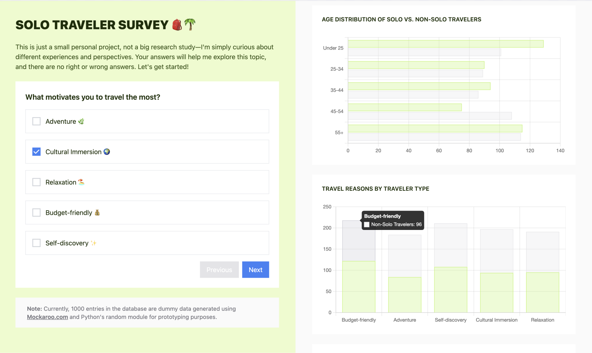

# Solo Traveler Survey Project



## Overview

The Solo Traveler Survey project is a web-based application designed to collect and analyze data on solo travelers' preferences and experiences. Users can submit their responses through a simple form, and the collected data is stored in a MySQL database. The application also provides statistical insights using interactive charts powered by Chart.js.

Additionally, as a thank-you for completing the survey, the application returns a personalized prediction to the user. A clustering model and a sentiment analysis model were implemented to generate insights based on the user's responses.

## Features

- User-friendly HTML form to collect survey responses
- Data storage using MySQL for persistence
- Flask backend to handle form submissions and database interactions
- Dynamic visualization of survey results with Chart.js
- Predictive insights using a clustering model and sentiment analysis
- Minimalistic UI for ease of use

## Tech Stack

- **Backend:** Flask (Python)
- **Frontend:** HTML, TailwindCSS, Flowbite, JavaScript
- **Database:** MySQL
- **Visualization:** Chart.js
- **Machine Learning:** Clustering & Sentiment Analysis Models

## Installation & Setup

### 1. Clone the Repository

```bash
git clone https://github.com/yourusername/solo-travel-survey.git
cd solo-travel-survey
```

### 2. Set Up a Virtual Environment

```bash
python -m venv venv
source venv/bin/activate  # On Windows use `venv\Scripts\activate`
```

### 3. Install Dependencies

```bash
pip install -r requirements.txt
```

### 4. Set Up MySQL Database

1. Create a new MySQL database.
2. Update `.env.sample` with your database credentials.

```bash
DB_HOST=localhost
DB_USER=root
DB_PASSWORD=your_database_password
DB_NAME=your_database_name
```

### 5. Run the Flask Application

```bash
flask run
```

The application will be available at `http://127.0.0.1:5000/`.

## 📊 Usage

1. Open the application in your browser.
2. Fill out the survey form and submit responses.
3. View real-time statistics on the results page, with data visualized using Chart.js.
4. Receive a personalized prediction based on your survey answers, generated by the machine learning models.

## 🔧 Future Improvements

- Additional visualizations and data insights
- Deployment to a cloud platform for public access
